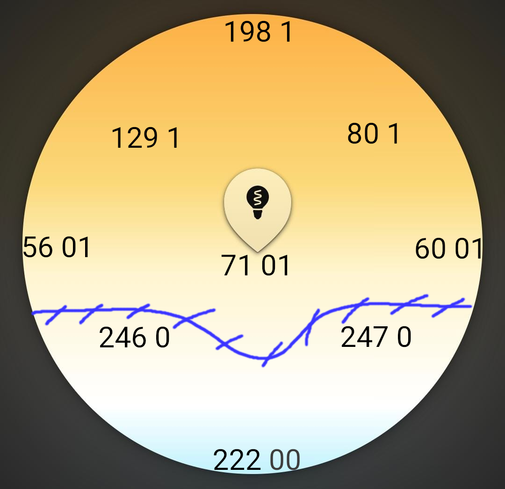

# Hue Filament Bulb

## Services

#### b8843add-0000-4aa1-8794-c3f462030bda
- Responds with long hex on start of app. Converting the hex to text isn't conclusive.

#### 9da2ddf1-0000-44d0-909c-3f3d3cb34a7b

##### xxxxx-0001-xxxxx
- Responds with `00 04` on app init

#### 932c32bd-0000-47a2-835a-a8d455b859dd

##### xxxxx-0002-xxxxx
- Changes to 00 or 01 if lamp is turned on or off

##### xxxxx-0003-xxxxx
- Changes brightness. Responds with one byte, where 254 is max and 01 min

##### xxxxx-0004-xxxxx
- Responds if color is changed. Seems like a 2-bytes value where the leading byte is the y-axis and 
the next is to interpret as a breakpoint which is set to 0 in the sphere below. 
Somewhere on the blue line the byte changes.

- Sending Data is also working but needs to follow the domain. Checking whether the input was valid can be done through the response.

##### xxxxx-0006-xxxxx
- Inconclusive, as only write mode.

##### xxxxx-0007-xxxxx
- Really weird behaviour. Seems to emit the color as above stated.

##### xxxxx-1005-xxxxx
- Inconclusive, as only write mode.